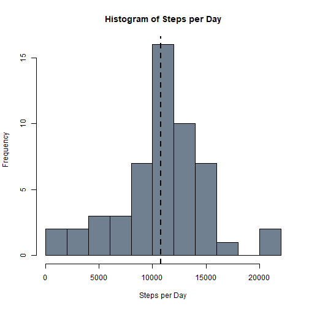
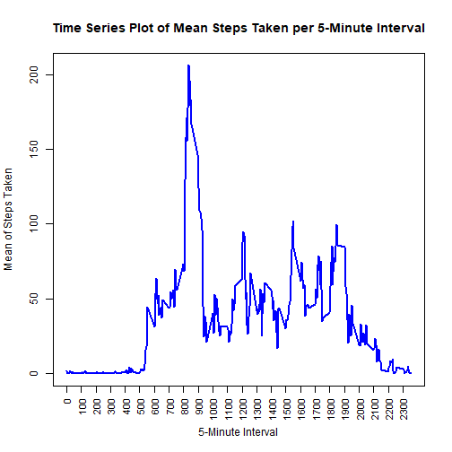
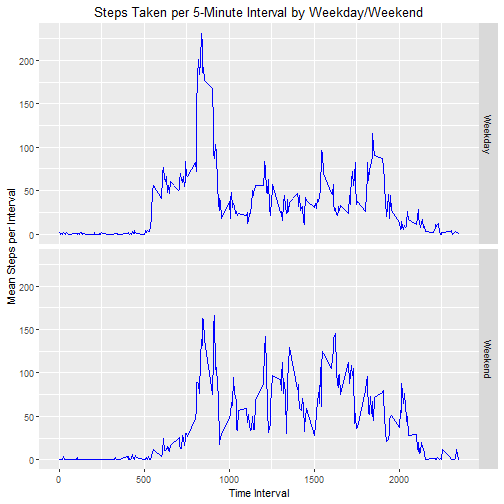

### Johns Hopkins University, Data Science Course 5: Reproducible Research 
#### Week 2 Project - December 29, 2018

This assignment makes use of data from a personal activity monitoring device. This device collects data at 5 minute intervals throughout the day. The data consists of two months of data from an anonymous individual collected during the months of October and November, 2012 and includes the number of steps taken in 5 minute intervals each day.


#### Loading and preprocessing the data
Show any code that is needed to:  

1. Load the data  

1. Process/transform the data (if necessary) into a format suitable for your analysis  


```r
pamd <- read.csv("activity.csv")
pamd$date <- as.Date(pamd$date)
```
_This analysis assumes the "activity.csv" file containing the raw data is in the working directory. The markdown file also loads the dplyr and ggplot2 libraries in the background. The "date" field is converted from a character format to a date format._

#### What is mean total number of steps taken per day?  
For this part of the assignment, you can ignore the missing values in the dataset.  

1. Calculate the total number of steps taken per day

1. Make a histogram of the total number of steps taken each day

1. Calculate and report the mean and median of the total number of steps taken per day


```r
pamd_bydate <- pamd %>% 
    group_by(date) %>% 
    summarise(steps_day = sum(steps))

pamd_mean <- mean(pamd_bydate$steps_day, na.rm = T)
pamd_median <- median(pamd_bydate$steps_day, na.rm = T)

hist(pamd_bydate$steps_day, 
     breaks = 10, 
     xlab = "Steps per Day",
     main = "Histogram of Steps per Day",
     col = "slategrey")

abline(v=pamd_mean, lty=2, lwd=2)
```



_The histogram above shows the distribution of steps taken per day with a mean of **10766.19**. The median of the data is **10765**._


####What is the average daily activity pattern?
1. Make a time series plot of the 5-minute interval (x-axis) and the average number of steps taken, averaged across all days (y-axis)

1. Which 5-minute interval, on average across all the days in the dataset, contains the maximum number of steps?


```r
pamd_byinterval <- na.omit(pamd) %>% 
    group_by(interval) %>% 
    summarise(steps_interval = mean(steps))

plot(pamd_byinterval, 
     type = "l",
     lwd = 2,
     col = "blue",
     xaxt = "n",
     xlab = "5-Minute Interval",
     ylab = "Mean of Steps Taken",
     main = "Time Series Plot of Mean Steps Taken per 5-Minute Interval")

axis(1, at = seq(from = 0, to = max(pamd_byinterval$interval), by = 100),
     las = 2, cex.axis = .9)
```



```r
pamd_max <- filter(pamd_byinterval, 
       pamd_byinterval$steps_interval == max(pamd_byinterval$steps_interval))
```

_The above chart shows the mean number of steps taken for each 5-minute interval in a day. The test subject took the highest number of steps on average at **835** with an average of **206 steps**._


####Imputing missing values

Note that there are a number of days/intervals where there are missing values (coded as NA). The presence of missing days may introduce bias into some calculations or summaries of the data.

1. Calculate and report the total number of missing values in the dataset (i.e. the total number of rows with NAs)

1. Devise a strategy for filling in all of the missing values in the dataset. The strategy does not need to be sophisticated. For example, you could use the mean/median for that day, or the mean for that 5-minute interval, etc.

1. Create a new dataset that is equal to the original dataset but with the missing data filled in.

1. Make a histogram of the total number of steps taken each day and Calculate and report the mean and median total number of steps taken per day. Do these values differ from the estimates from the first part of the assignment? What is the impact of imputing missing data on the estimates of the total daily number of steps?


```r
missing <- sum(is.na(pamd$steps))

pamd_new <- pamd %>% 
    group_by(interval) %>% 
    mutate(steps_new = ifelse(is.na(steps), mean(steps, na.rm = T), steps))

pamd_bydate_new <- pamd_new %>% 
    group_by(date) %>% 
    summarise(steps_day = sum(steps))

pamd_new_mean <- mean(pamd_bydate_new$steps_day, na.rm = T)
pamd_new_median <- median(pamd_bydate_new$steps_day, na.rm = T)

hist(pamd_bydate_new$steps_day, 
     breaks = 10, 
     xlab = "Steps per Day",
     main = "Histogram of Steps per Day",
     col = "slategrey")

abline(v=pamd_new_mean, lty=2, lwd=2)
```


_The number of observations with NA values is **2304**. Replacing these values with the mean of their 5-minute intervals has **no effect** on the overall mean and median of the dataset. The mean remains **10766.19** and the medain remains **10765**._


####Are there differences in activity patterns between weekdays and weekends?

1. Create a new factor variable in the dataset with two levels – “weekday” and “weekend” indicating whether a given date is a weekday or weekend day. 

1. Make a panel plot containing a time series plot of the 5-minute interval (x-axis) and the average number of steps taken, averaged across all weekday days or weekend days (y-axis). See the README file in the GitHub repository to see an example of what this plot should look like using simulated data.


```r
pamd_new <- pamd %>% 
    group_by(interval) %>% 
    mutate(steps_new = ifelse(is.na(steps), mean(steps, na.rm = T), steps))

pamd_new$day <- weekdays(pamd_new$date)
pamd_new$weekday <- as.factor(ifelse(pamd_new$day == "Saturday" | 
                                         pamd_new$day == "Sunday", 
                                     "Weekend", "Weekday"))

pamd_new_byinterval <- pamd_new %>%
    group_by(weekday, interval) %>% 
    summarise(steps_interval = mean(steps_new))

ggplot(pamd_new_byinterval, aes(x = interval, y = steps_interval)) +
    geom_line(col = "blue") + 
    facet_grid(pamd_new_byinterval$weekday ~ .) +
    xlab("Time Interval") +
    ylab("Mean Steps per Interval") +
    ggtitle("Steps Taken per 5-Minute Interval by Weekday/Weekend") +
    theme(plot.title = element_text(hjust = .5))
```



_The above chart shows the mean steps taken per 5-minute interval, comparing weekdays to weekends. The charts show that the individual generally took more steps in the middle of the day (from 1000 to 1700) on the weekend than he/she did on weekdays. Both weekdays and weekends showed a peak activity in the morning around 830._


